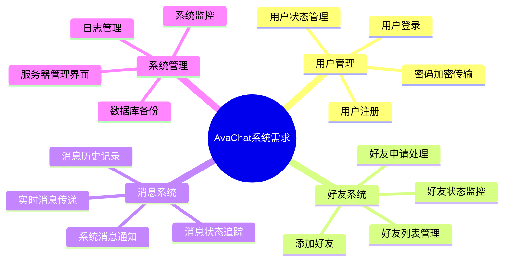
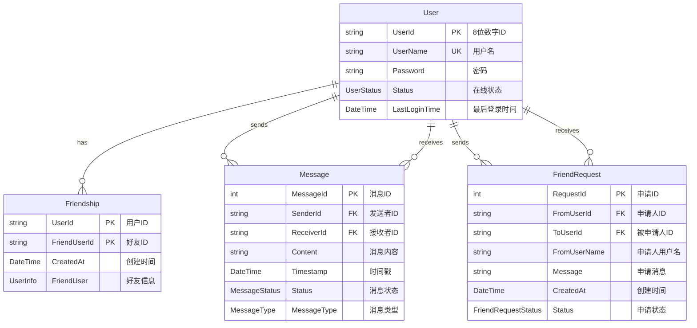
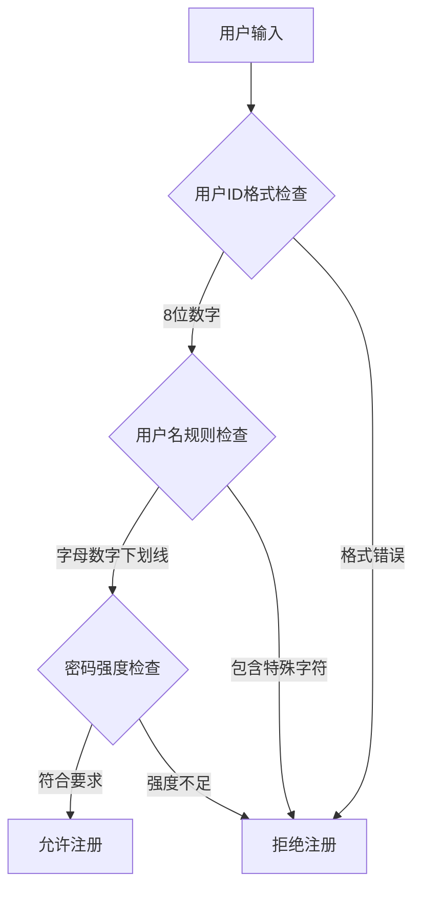
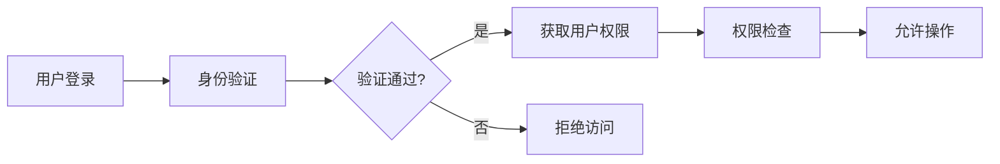
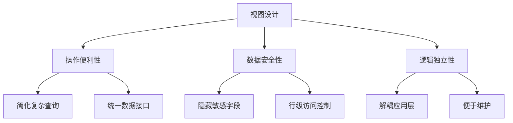
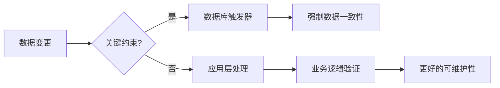
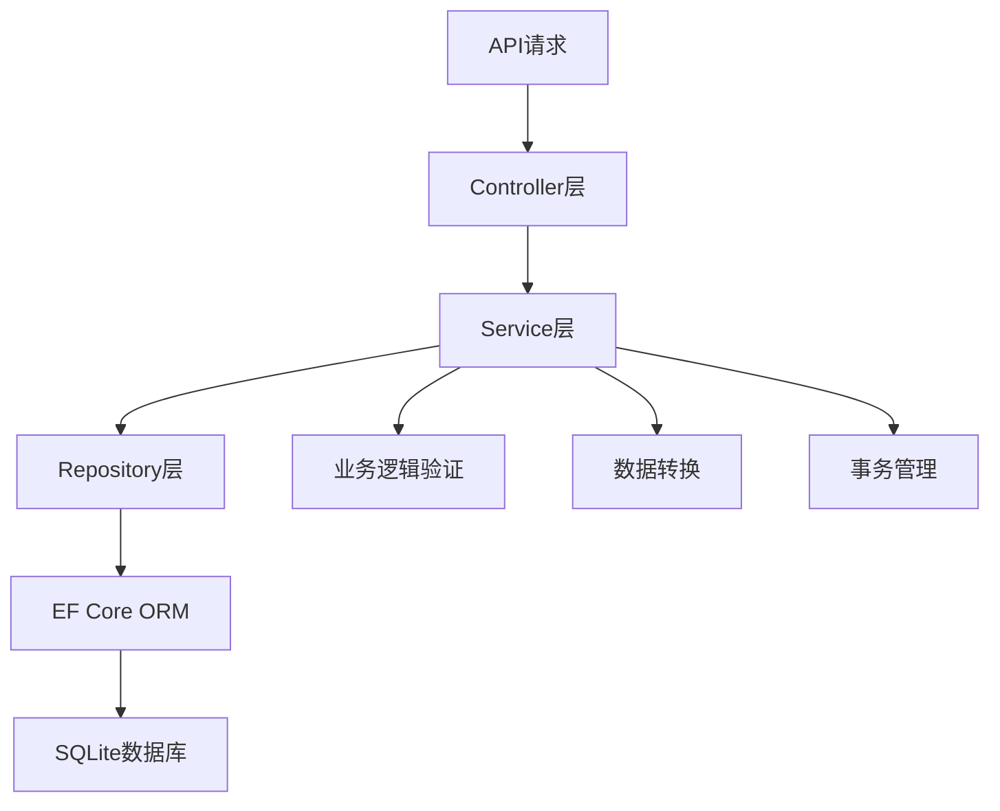
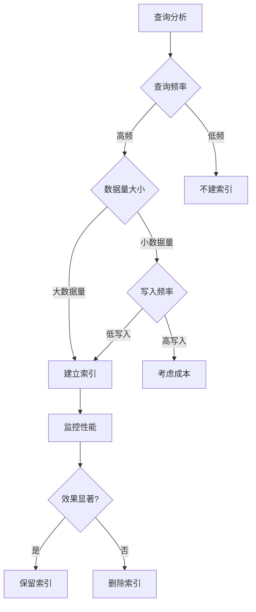
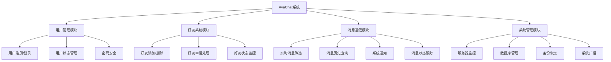
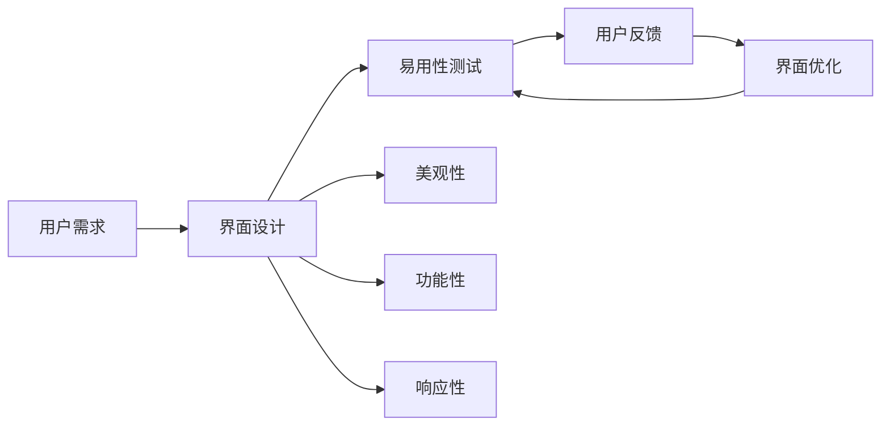

# AvaChat 即时通讯系统技术文档

## 目录
1. [需求分析](#需求分析)
2. [数据库设计](#数据库设计)
3. [数据完整性](#数据完整性)
4. [安全性](#安全性)
5. [视图](#视图)
6. [触发器](#触发器)
7. [存储过程](#存储过程)
8. [索引](#索引)
9. [系统功能](#系统功能)
10. [用户界面友好性](#用户界面友好性)

---

## 需求分析

### 1.1 项目背景
AvaChat是一个基于C#/.NET 9.0和Avalonia UI框架的跨平台即时通讯系统，支持实时消息传递、好友管理和系统通知功能。

### 1.2 功能需求分析



### 1.3 非功能需求
- **性能要求**：支持100+并发用户
- **可用性**：7×24小时运行
- **安全性**：数据传输加密，用户身份验证
- **扩展性**：模块化设计，易于功能扩展
- **跨平台**：支持Windows、Linux、macOS

---

## 数据库设计

### 2.1 概念模型



### 2.2 逻辑结构设计

#### 2.2.1 用户表 (Users)
- **UserId**: 主键，8位数字字符串
- **UserName**: 唯一索引，用户名
- **Password**: 密码（数据库存明文，传输时AES加密）
- **Status**: 用户状态枚举
- **LastLoginTime**: 最后登录时间

#### 2.2.2 好友关系表 (Friendships)
- **复合主键**: (UserId, FriendUserId)
- **双向关系**: 每个好友关系存储两条记录
- **3NF设计**: 避免数据冗余

#### 2.2.3 消息表 (Messages)
- **MessageId**: 自增主键
- **外键约束**: SenderId和ReceiverId引用Users表
- **时间戳索引**: 支持快速时间范围查询

#### 2.2.4 好友申请表 (FriendRequests)
- **RequestId**: 自增主键
- **复合唯一索引**: (FromUserId, ToUserId, Status=Pending)
- **状态过滤索引**: 快速查询待处理申请

### 2.3 物理设计
- **数据库引擎**: SQLite 3.x
- **WAL模式**: 提高并发读写性能
- **外键约束**: 启用以确保数据完整性

---

## 数据完整性

### 3.1 实体完整性
```csharp
// EF Core 模型配置 - ServerDbContext.cs
protected override void OnModelCreating(ModelBuilder modelBuilder)
{
    // Users表主键配置
    modelBuilder.Entity<User>()
        .HasKey(u => u.UserId);

    // Friendships复合主键配置
    modelBuilder.Entity<Friendship>()
        .HasKey(f => new { f.UserId, f.FriendUserId });

    // Messages表主键配置
    modelBuilder.Entity<Message>()
        .HasKey(m => m.MessageId);

    // FriendRequests表主键配置
    modelBuilder.Entity<FriendRequest>()
        .HasKey(fr => fr.RequestId);
}
```

### 3.2 参照完整性
```csharp
// EF Core 外键关系配置
protected override void OnModelCreating(ModelBuilder modelBuilder)
{
    // Friendships外键约束
    modelBuilder.Entity<Friendship>()
        .HasOne<User>()
        .WithMany()
        .HasForeignKey(f => f.UserId)
        .OnDelete(DeleteBehavior.Cascade);

    modelBuilder.Entity<Friendship>()
        .HasOne<User>()
        .WithMany()
        .HasForeignKey(f => f.FriendUserId)
        .OnDelete(DeleteBehavior.Cascade);

    // Messages外键约束
    modelBuilder.Entity<Message>()
        .HasOne<User>()
        .WithMany()
        .HasForeignKey(m => m.SenderId)
        .OnDelete(DeleteBehavior.Restrict);

    modelBuilder.Entity<Message>()
        .HasOne<User>()
        .WithMany()
        .HasForeignKey(m => m.ReceiverId)
        .OnDelete(DeleteBehavior.Restrict);

    // FriendRequests外键约束
    modelBuilder.Entity<FriendRequest>()
        .HasOne<User>()
        .WithMany()
        .HasForeignKey(fr => fr.FromUserId)
        .OnDelete(DeleteBehavior.Cascade);

    modelBuilder.Entity<FriendRequest>()
        .HasOne<User>()
        .WithMany()
        .HasForeignKey(fr => fr.ToUserId)
        .OnDelete(DeleteBehavior.Cascade);
}
```

### 3.3 域完整性
```csharp
// 数据注解和验证属性 - User.cs
public class User
{
    [Key, StringLength(8), RegularExpression(@"^[0-9]+$",
        ErrorMessage = "用户ID为8位且只能包含数字。")]
    public string UserId { get; set; } = string.Empty;

    [Required, RegularExpression(@"^[a-zA-Z0-9_]+$",
        ErrorMessage = "用户名只能包含字母、数字和下划线。"),
     MinLength(3, ErrorMessage = "用户名长度必须在3到50个字符之间。"),
     MaxLength(50)]
    public string UserName { get; set; } = string.Empty;

    [Required]
    public string Password { get; set; } = string.Empty;

    public UserStatus Status { get; set; } = UserStatus.Offline;

    public DateTime? LastLoginTime { get; set; }
}

// 枚举定义确保数据完整性
public enum UserStatus
{
    Offline = 0, // 离线
    Online = 1,  // 在线
}

public enum MessageType
{
    Text = 0,    // 文本消息
    Image = 1,   // 图片消息
    File = 2,    // 文件消息
    System = 3,  // 系统消息
}
```

### 3.4 用户定义完整性



---

## 安全性

### 4.1 用户认证与授权

#### 4.1.1 密码安全策略
```csharp
// AES加密传输（客户端到服务器）
public class SecurityService
{
    private static readonly byte[] Key = Encoding.UTF8.GetBytes("AvaChat2024SecretKey1234567890Ab"); // 32字节

    public static string EncryptPassword(string password)
    {
        using var aes = Aes.Create();
        aes.Key = Key;
        // 加密实现...
    }
}
```

#### 4.1.2 访问控制模型


### 4.2 数据库备份与恢复

#### 4.2.1 备份策略
```csharp
public class DatabaseBackupService
{
    // 自动备份：每天凌晨2点
    public async Task CreateBackupAsync()
    {
        var backupPath = Path.Combine(AppDataPath, "Backups",
            $"backup_{DateTime.Now:yyyyMMdd_HHmmss}.db");

        // 使用WAL模式下的在线备份
        await BackupDatabaseAsync(backupPath);
    }
}
```

#### 4.2.2 恢复机制
- **自动恢复**: 启动时检测数据库完整性
- **手动恢复**: 管理员界面选择备份文件恢复
- **增量备份**: 支持基于WAL文件的增量备份

### 4.3 网络安全
- **SignalR连接**: 使用HTTPS/WSS加密通道
- **API接口**: RESTful API with JSON over HTTPS
- **输入验证**: 所有用户输入进行严格验证

---

## 视图

### 5.1 系统视图设计

#### 5.1.1 用户好友视图
```csharp
// 用户好友查询 - FriendController.cs 或 Repository
public async Task<List<UserFriendDto>> GetUserFriendsAsync(string userId)
{
    return await _context.Friendships
        .Where(f => f.UserId == userId)
        .Join(_context.Users,
            f => f.FriendUserId,
            u => u.UserId,
            (f, u) => new UserFriendDto
            {
                UserId = userId,
                FriendUserId = u.UserId,
                FriendUserName = u.UserName,
                FriendStatus = u.Status,
                FriendSince = f.CreatedAt
            })
        .ToListAsync();
}

// 数据传输对象
public class UserFriendDto
{
    public string UserId { get; set; }
    public string FriendUserId { get; set; }
    public string FriendUserName { get; set; }
    public UserStatus FriendStatus { get; set; }
    public DateTime FriendSince { get; set; }
}
```

#### 5.1.2 消息统计视图
```csharp
// 消息统计查询 - ChatController.cs 或 Repository
public async Task<List<MessageStatsDto>> GetMessageStatsAsync()
{
    return await _context.Messages
        .Where(m => m.MessageType != MessageType.System) // 排除系统消息
        .GroupBy(m => m.SenderId)
        .Select(g => new MessageStatsDto
        {
            SenderId = g.Key,
            MessageCount = g.Count(),
            LastMessageTime = g.Max(m => m.Timestamp),
            FailedMessages = g.Count(m => m.Status == MessageStatus.Failed)
        })
        .ToListAsync();
}

// 数据传输对象
public class MessageStatsDto
{
    public string SenderId { get; set; }
    public int MessageCount { get; set; }
    public DateTime LastMessageTime { get; set; }
    public int FailedMessages { get; set; }
}
```

### 5.2 视图优势分析



---

## 触发器

### 6.1 触发器应用分析

#### 6.1.1 是否采用触发器？
**不推荐在SQLite中大量使用触发器**，原因如下：
- SQLite触发器功能相对有限
- 业务逻辑在应用层更易维护
- 调试和测试更加方便

#### 6.1.2 业务逻辑验证
```csharp
// 在EF Core中，使用应用层验证替代触发器 - FriendController.cs
public async Task<IActionResult> AddFriendshipAsync(string userId, string friendUserId)
{
    // 防止自己添加自己为好友
    if (userId == friendUserId)
    {
        return BadRequest("不能添加自己为好友");
    }

    // 检查是否已经是好友
    var existingFriendship = await _context.Friendships
        .FirstOrDefaultAsync(f =>
            (f.UserId == userId && f.FriendUserId == friendUserId) ||
            (f.UserId == friendUserId && f.FriendUserId == userId));

    if (existingFriendship != null)
    {
        return BadRequest("已经是好友关系");
    }

    // 创建双向好友关系
    var friendship1 = new Friendship
    {
        UserId = userId,
        FriendUserId = friendUserId,
        CreatedAt = DateTime.UtcNow
    };
    var friendship2 = new Friendship
    {
        UserId = friendUserId,
        FriendUserId = userId,
        CreatedAt = DateTime.UtcNow
    };

    _context.Friendships.AddRange(friendship1, friendship2);
    await _context.SaveChangesAsync();

    return Ok("好友添加成功");
}
```

### 6.2 业务逻辑处理策略



---

## 存储过程

### 7.1 存储过程评估

#### 7.1.1 不推荐使用存储过程
**在本系统中不使用存储过程**，基于以下考虑：
- SQLite存储过程支持有限
- 跨平台兼容性问题
- ORM框架已提供足够抽象

#### 7.1.2 替代方案
```csharp
// 使用Repository模式封装复杂业务逻辑
public class MessageRepository
{
    public async Task<List<Message>> GetChatHistoryAsync(string userId, string friendId)
    {
        return await _context.Messages
            .Where(m => (m.SenderId == userId && m.ReceiverId == friendId) ||
                       (m.SenderId == friendId && m.ReceiverId == userId))
            .OrderBy(m => m.Timestamp)
            .ToListAsync();
    }
}
```

### 7.2 业务处理架构



---

## 索引

### 8.1 数据量估算

| 表名           | 预估记录数     | 增长率 | 关键查询字段                    |
| -------------- | -------------- | ------ | ------------------------------- |
| Users          | 1,000-10,000   | 低     | UserId, UserName                |
| Friendships    | 50,000-500,000 | 中     | UserId, FriendUserId            |
| Messages       | 1,000,000+     | 高     | SenderId, ReceiverId, Timestamp |
| FriendRequests | 1,000-10,000   | 低     | ToUserId, Status                |

### 8.2 索引设计策略

#### 8.2.1 索引配置
```csharp
// EF Core 索引配置 - ServerDbContext.cs
protected override void OnModelCreating(ModelBuilder modelBuilder)
{
    // Users表索引
    modelBuilder.Entity<User>()
        .HasIndex(u => u.UserId)
        .IsUnique()
        .HasDatabaseName("IX_Users_UserId");

    modelBuilder.Entity<User>()
        .HasIndex(u => u.UserName)
        .IsUnique()
        .HasDatabaseName("IX_Users_UserName");

    modelBuilder.Entity<User>()
        .HasIndex(u => new { u.Status, u.LastLoginTime })
        .HasDatabaseName("IX_Users_Status_LastLogin");

    // Messages表索引
    modelBuilder.Entity<Message>()
        .HasIndex(m => new { m.SenderId, m.ReceiverId, m.Timestamp })
        .HasDatabaseName("IX_Messages_Sender_Receiver_Time");

    modelBuilder.Entity<Message>()
        .HasIndex(m => m.Timestamp)
        .HasDatabaseName("IX_Messages_Timestamp");

    modelBuilder.Entity<Message>()
        .HasIndex(m => new { m.Status, m.MessageType })
        .HasDatabaseName("IX_Messages_Status_Type");

    // FriendRequests表索引
    modelBuilder.Entity<FriendRequest>()
        .HasIndex(fr => new { fr.FromUserId, fr.ToUserId })
        .IsUnique()
        .HasFilter("Status = 0") // WHERE Status = 0 (Pending)
        .HasDatabaseName("IX_FriendRequests_From_To_Pending");

    modelBuilder.Entity<FriendRequest>()
        .HasIndex(fr => new { fr.ToUserId, fr.Status })
        .HasDatabaseName("IX_FriendRequests_To_Status");
}
```

#### 8.2.2 索引优化决策树



---

## 系统功能

### 9.1 核心功能模块



### 9.2 详细功能规格

#### 9.2.1 用户管理功能
- **用户注册**: 8位数字ID + 用户名 + 密码
- **用户登录**: 密码AES加密传输
- **状态管理**: 在线/离线状态实时更新
- **多端登录**: 支持同一用户多设备登录

#### 9.2.2 好友系统功能
- **好友搜索**: 按用户ID/用户名搜索
- **好友申请**: 发送申请消息
- **申请处理**: 接受/拒绝好友申请
- **好友列表**: 实时状态显示
- **好友删除**: 双向关系解除

#### 9.2.3 消息通信功能
- **实时传输**: 基于SignalR WebSocket
- **消息类型**: 文本/图片/文件/系统消息
- **消息状态**: 发送中/已送达/发送失败
- **历史记录**: 本地数据库存储
- **系统通知**: 好友申请/系统广播

#### 9.2.4 系统管理功能
- **服务器监控**: 在线用户数/消息统计
- **数据库管理**: 备份/恢复/优化
- **日志管理**: 操作日志/错误日志
- **系统广播**: 向所有在线用户发送通知

---

## 用户界面友好性

### 10.1 界面设计原则

#### 10.1.1 用户体验优先


### 10.2 界面友好性特性

#### 10.2.1 视觉设计
- **现代化UI**: 使用Fluent Design设计语言
- **暗色主题**: 支持系统主题跟随
- **图标语言**: 直观的功能图标
- **色彩搭配**: 舒适的视觉体验

#### 10.2.2 交互设计
- **快捷键支持**: Ctrl+Enter发送消息
- **拖拽操作**: 文件拖拽发送
- **上下文菜单**: 右键快捷操作
- **键盘导航**: 完整的键盘支持

#### 10.2.3 响应式设计
```csharp
// 滚动区域优化示例
<ScrollViewer
    MaxHeight="300"
    AllowAutoHide="True"
    HorizontalScrollBarVisibility="Disabled"
    VerticalScrollBarVisibility="Auto"
    ScrollBarMargin="0,0,4,0">
    <!-- 内容区域 -->
</ScrollViewer>
```

#### 10.2.4 用户体验优化

| 功能     | 优化措施             | 用户受益         |
| -------- | -------------------- | ---------------- |
| 消息输入 | 自适应高度，支持多行 | 长消息编辑便利   |
| 好友列表 | 实时状态，头像显示   | 快速识别在线好友 |
| 通知系统 | 分类显示，一键处理   | 高效处理申请     |
| 错误处理 | 友好提示，自动重试   | 减少操作挫败感   |
| 数据加载 | 加载动画，增量加载   | 提升响应感知     |

### 10.3 性能优化

- **虚拟化列表**: 大量数据高效显示
- **延迟加载**: 非关键内容延迟加载
- **内存管理**: 及时释放不用资源

---